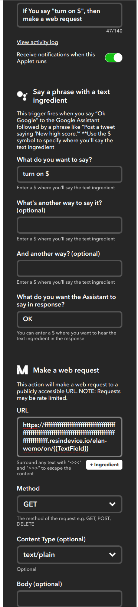

Elan / Wemo Google Assistant Integration
========================================

This is a node.js based application that runs on a local network device (like Raspberry Pi) and can scan your network for
WeMo and Elan-emulated WeMo devices. Elan's Alexa integration works by making Alexa-controllable lights appear on
the network the same as WeMo devices. You can connect a Maker Channel applet to this service, connected to your Google
Assistant to control Elan devices that would not be otherwise controllable.

To get this project up and running, you will need to signup for a resin.io account [here][https://resin.io]
and set up a device, have a look at our [Getting Started tutorial][https://docs.resin.io/raspberrypi/nodejs/getting-started].
You are strongly encouraged to go through the getting started tutorial. Once you do, the rest of this will make much more
sense.  Once you are set up with resin.io, you will need to clone this repo locally:
```
$ git clone git@github.com:kmixter/elan-wemo.git
```
You need to flash an SDCard with an appropriate ResinOS (Linux) image for your resin.io account. Once Raspberry Pi boots from
this image, you will get a resin.io git repository to push code to the device.

To push the code, add your resin.io application's remote repository to your local repository:
```
$ git remote add resin username@git.resin.io:username/myapp.git
```
and push the code to the newly added remote:
```
$ git push resin master
```
It should take a few minutes for the code to push. While you wait, let's enable device URLs so
we can see the server outside of our local network. This option can be found in the `Actions`
tab in your device dashboard.

You will be given a URL like:
        
https://ffffffffffffffffffffffffffffffffffffffffffffffffffffffffffffff.resindevice.io

Use this hostname $HOSTNAME below. Wait for the device to indicate it is listening on port 80, then you
know it is running. It will look roughly like this:


In your browser you can now access this URL. First, tell the elan-wemo app to scan your
network for devices:

http://$HOSTNAME/elan-wemo/scan

To see what it found use this URL:
http://$HOSTNAME/elan-wemo/list

You can also test turning lights on and off at this URL.

Setting up IFTTT
----------------

Now that you have a device with a globally visible URL, you can create two IFTTT rules to
turn on and turn off your lights, like these:


You will use the $HOSTNAME above as shown below in a fully configured recipe.




Creating Aliases
----------------

It may be helpful to create aliases for some lights. For instance, you might have a device that
is sometimes called the living room light and sometimes called the family room light. If the device's
name (from when you set it up) is "living room" you can use this URL to give it an alias of family
room:

http://$HOSTNAME/elan-wemo/alias/family room/living room.

When you use http://$HOSTNAME/elan-wemo/list you will see the new alias for this device.
